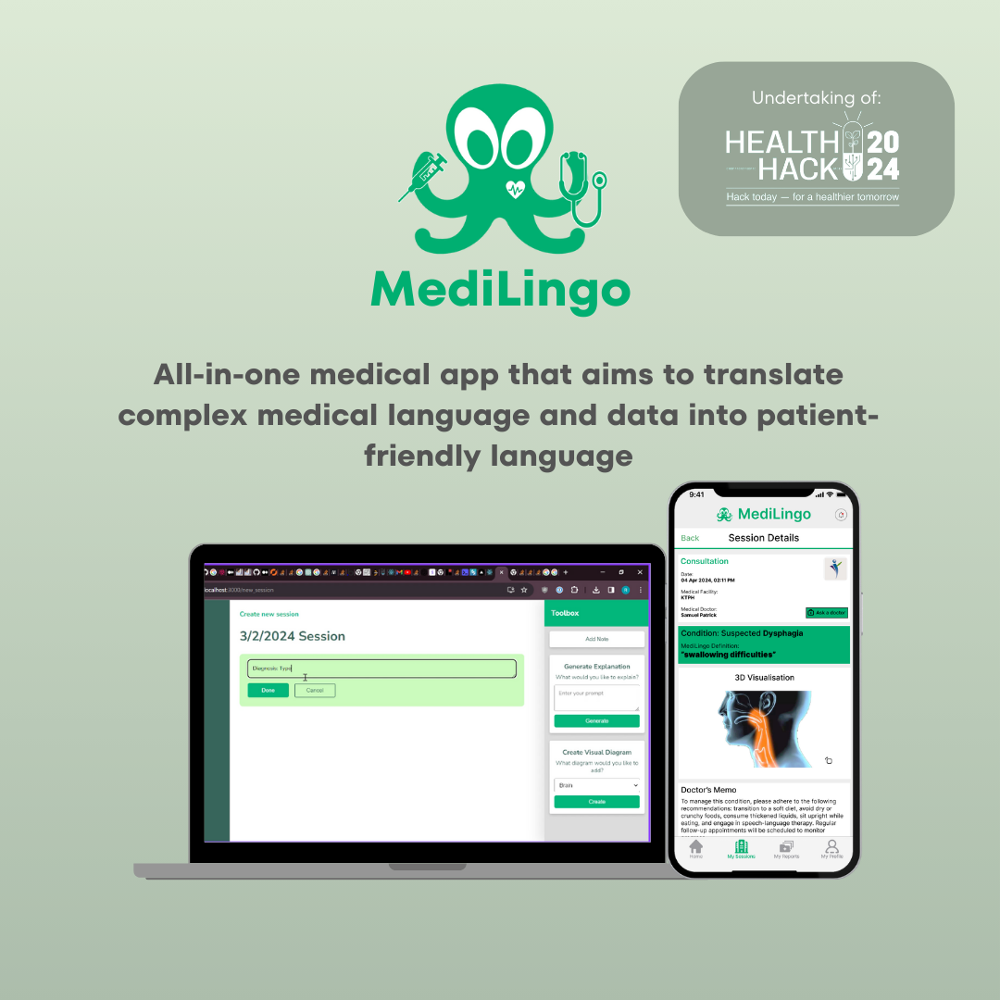
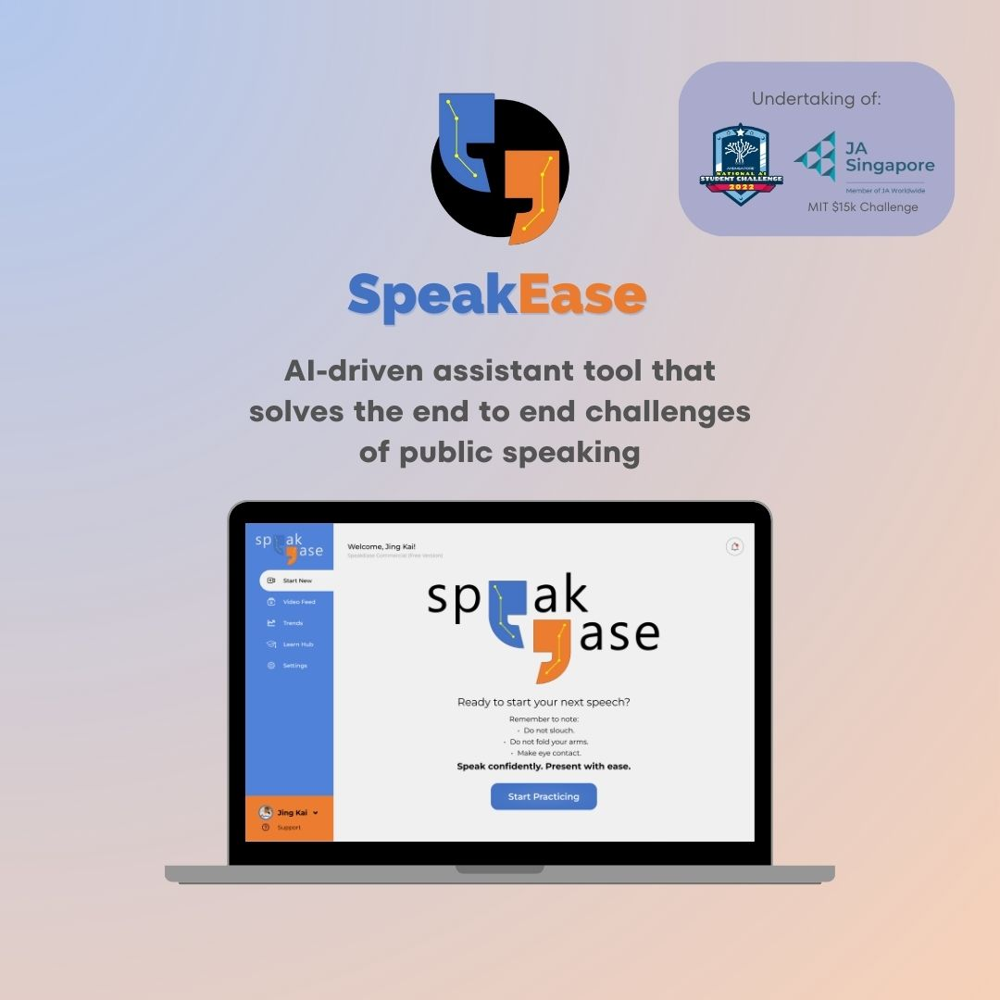
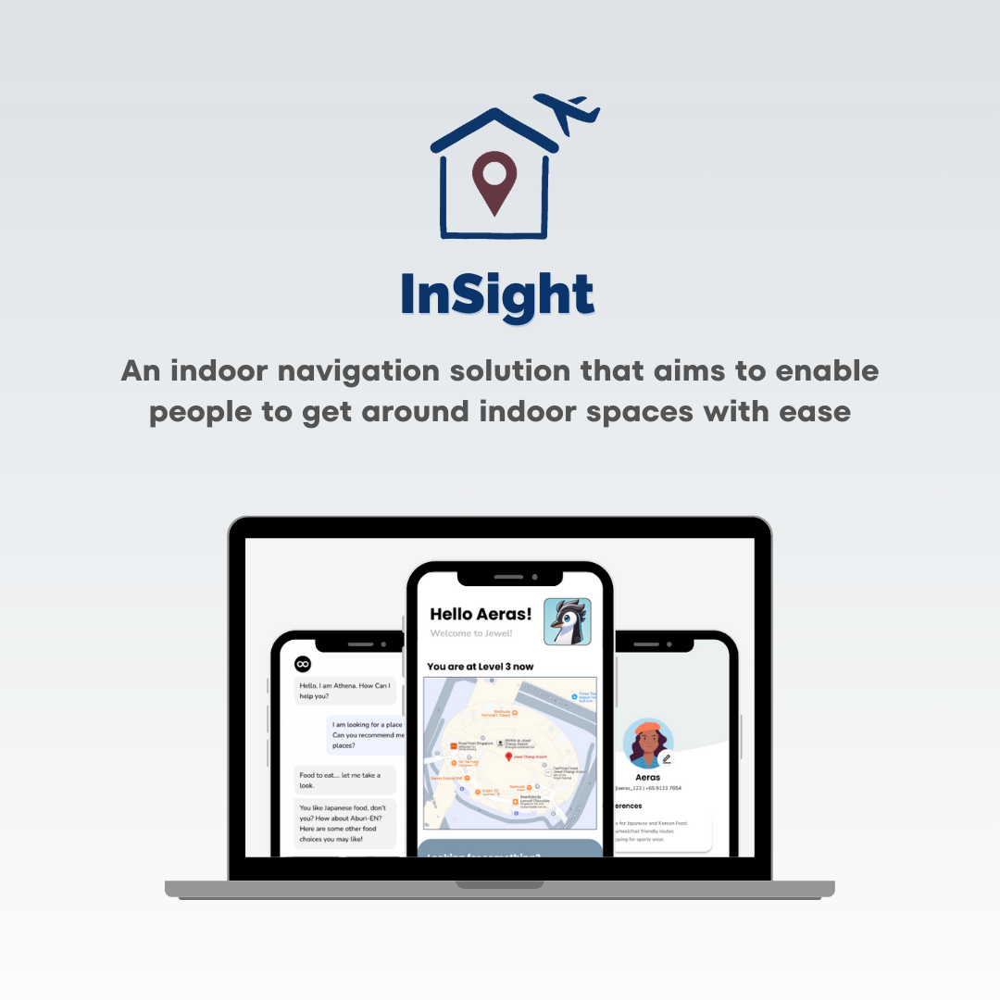
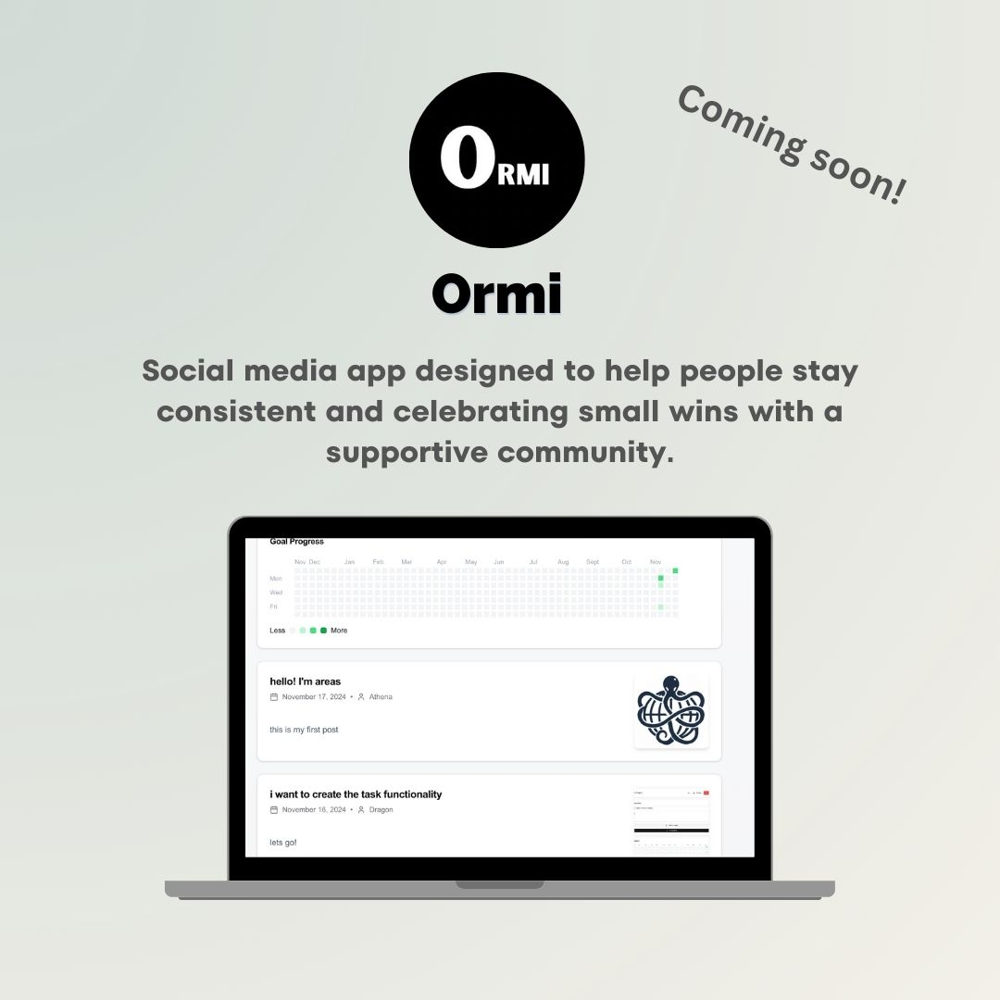
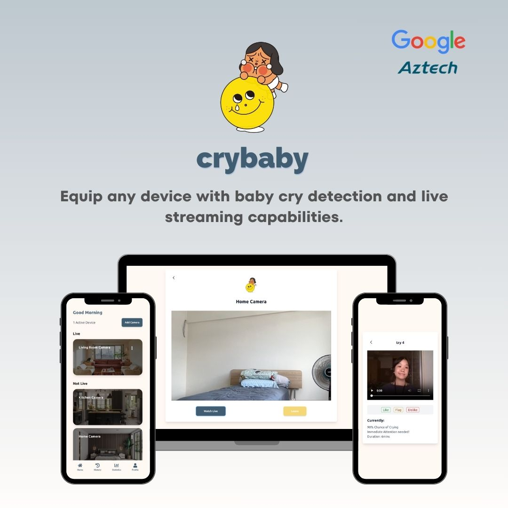
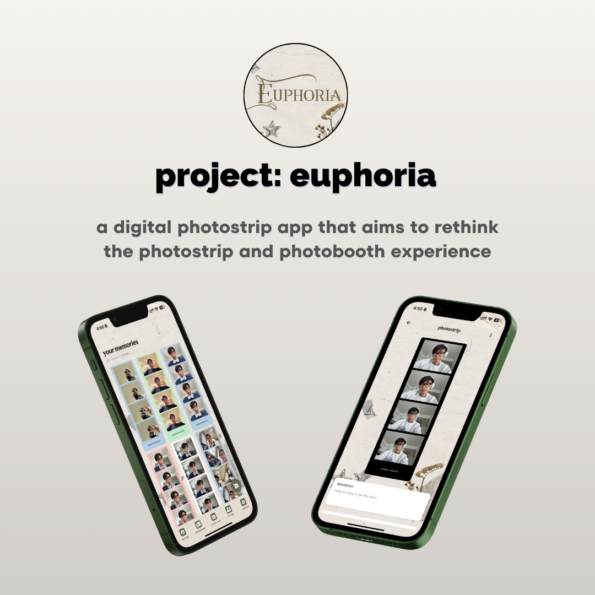
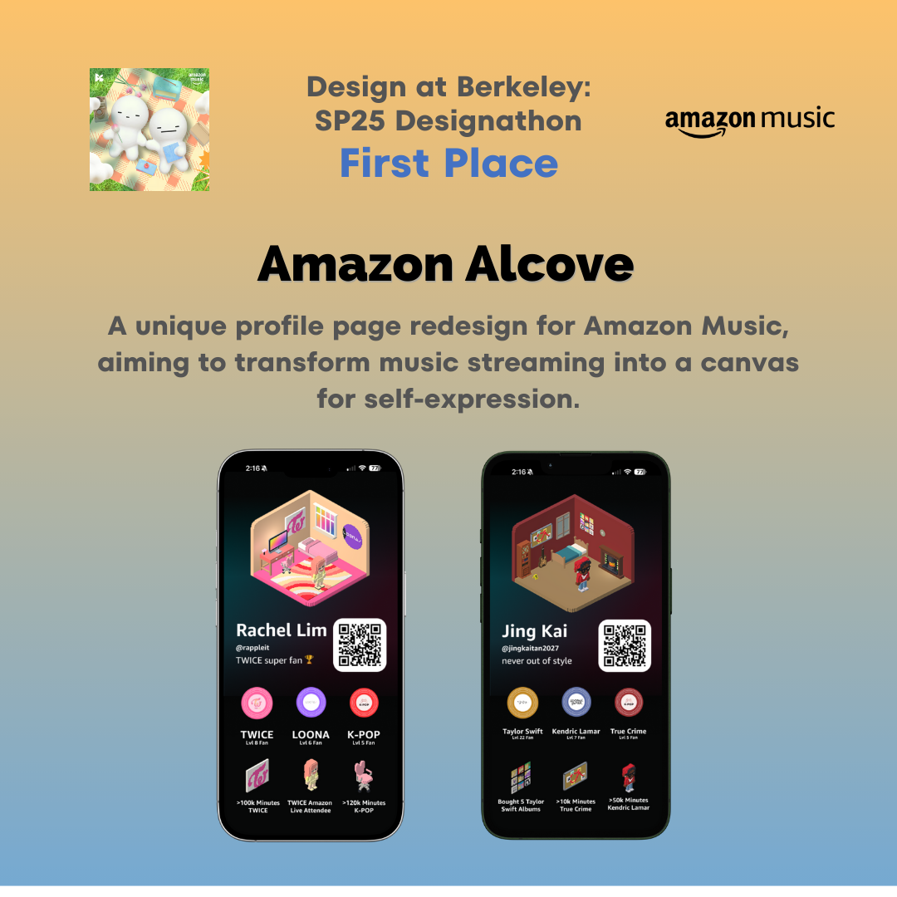

    

  

  

- 💻 I am a passionate **Computer Science student** studying at SUTD

- 🔭 I’m currently working on **creating 12 Startups in 12 Months!**

- 👯 I’m looking for collaboration opportunities on **improving my personal website.**

- 👨‍💻 All of my projects are available at [jingkai27.github.io/website](jingkai27.github.io/website)

- 💬 Ask me about **Python, Java and Algorithms!**

- 📫 How to reach me: **jingkai.t27@gmail.com**

- ⚡ Fun fact! **My 2025 resolution is to do Leetcode everyday.**

 
<h3 align="left">Portfolio projects:</h3>
<table>
  <tr>
    <td></td>
    <td></td>
    <td></td>
  </tr>
  <tr>
    <td></td>
    <td></td>
    <td></td>
  </tr>
  <tr>
    <td></td>
    <td></td>
    <td></td>
  </tr>
</table>

 
<h3 align="left">Archived Projects:</h3>
<table>
  <tr>
<td></td>
    <!-- <td></td>
    <td></td>
    <td></td> -->
  </tr>
</table>

 

<h3 align="left">Languages and Tools:</h3>

  

&nbsp;

