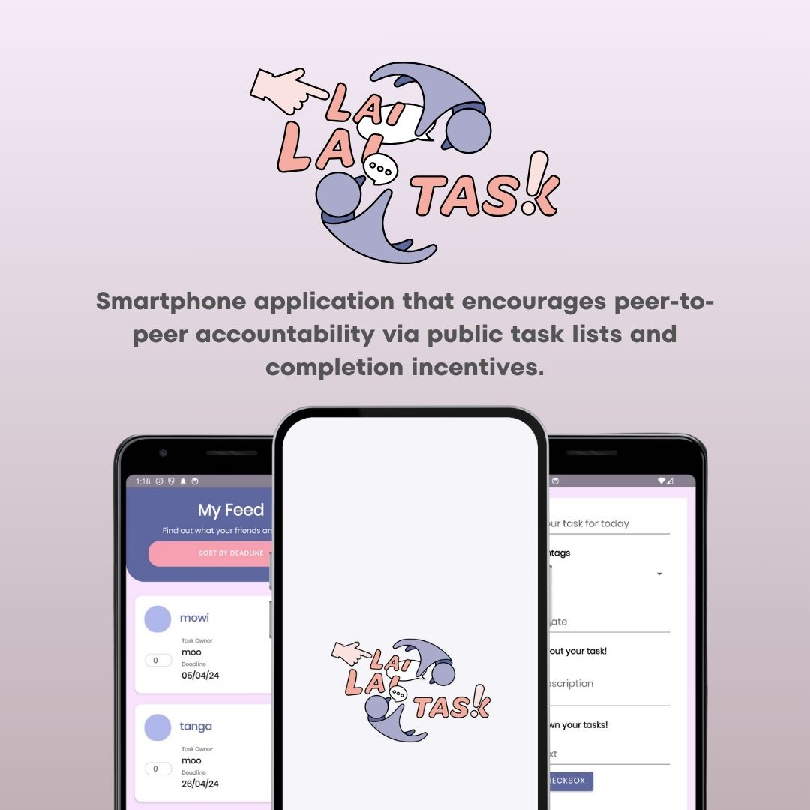

<h1 align="center">Hi 👋, I'm Jing Kai!</h1>
<h3 align="center">A passionate Computer Science student in SUTD!</h3>

  

  

- 🔭 I’m currently working on **a University web app to optimise students' QnA in class.**

- 👯 I’m looking for collaboration opportunities on **improving my personal website.**

- 👨‍💻 All of my projects are available at [jingkai27.github.io/website](jingkai27.github.io/website)

- 💬 Ask me about **Python (for now).**

- 📫 How to reach me: **jingkai.t27@gmail.com**

- ⚡ Fun fact! **My 2024 resolution is to commit to GitHub everyday.**

 
<h3 align="left">My Projects:</h3>

<table>
  <tr>
    <td></td>
    <td></td>
    <td></td>
  </tr>
  <tr>
    <td></td>
    <td></td>
    <td></td>
  </tr>
  <tr>
    <td></td>
    <td></td>
    <td></td>
  </tr>
</table>

<h3 align="left">Languages and Tools:</h3>

          

&nbsp;

