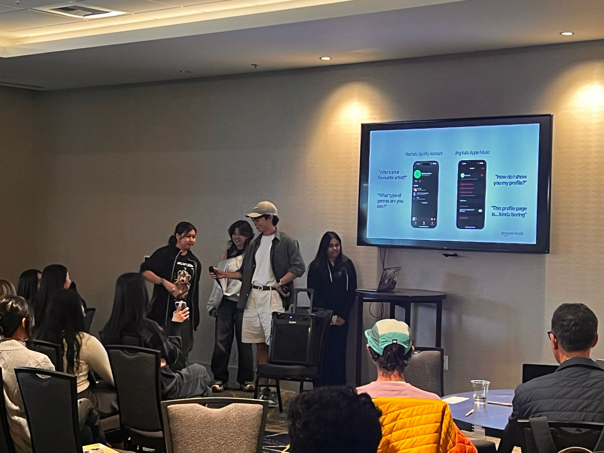
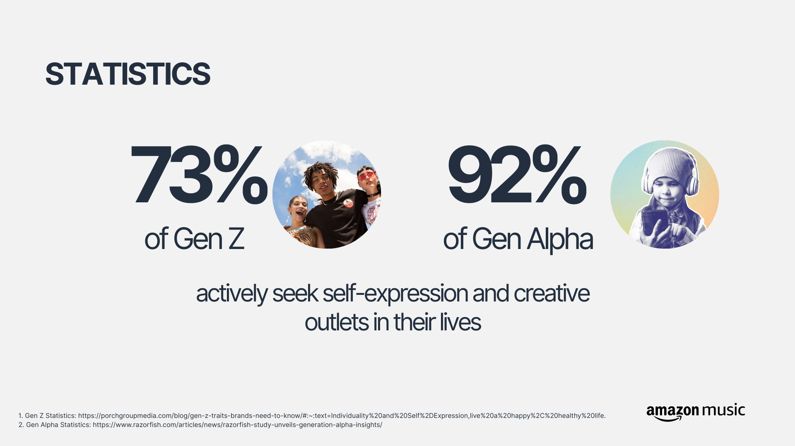
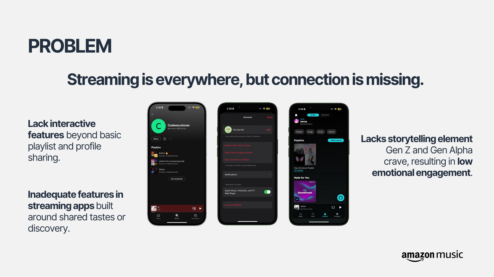
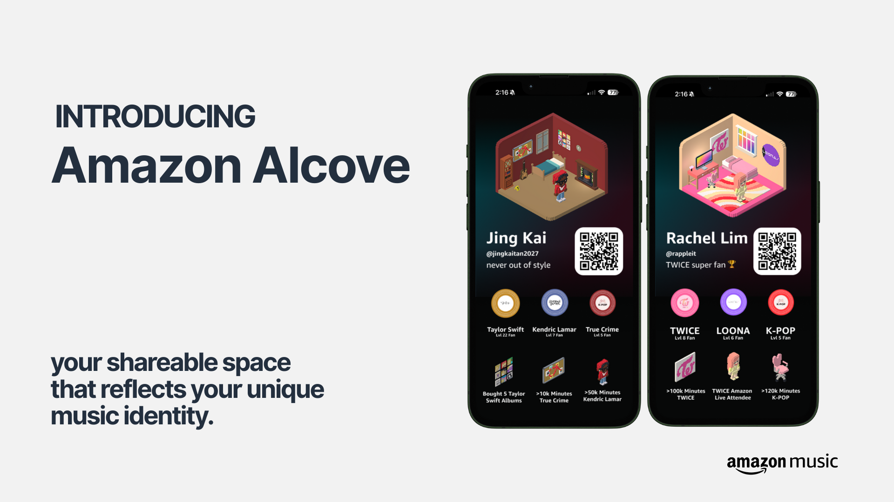
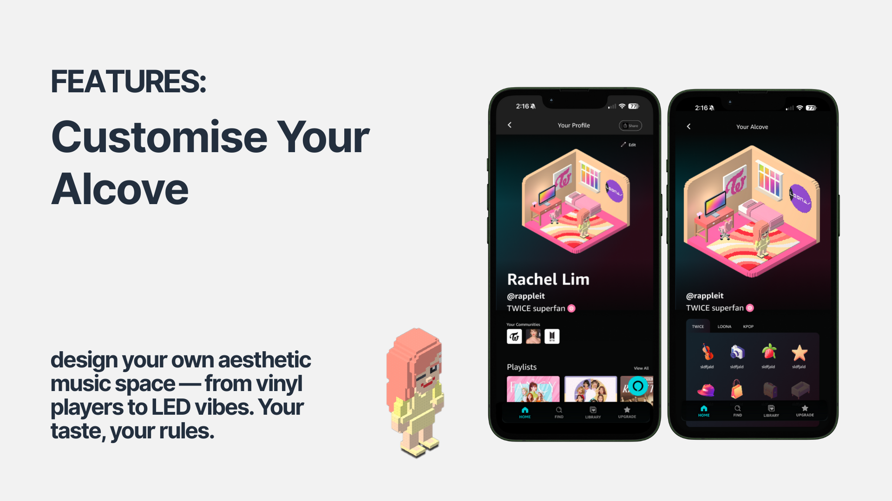
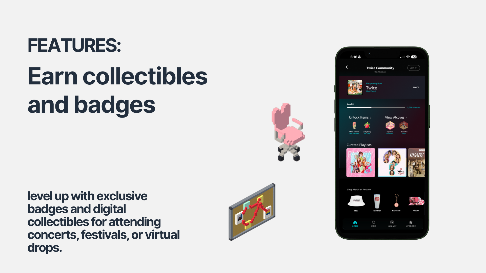
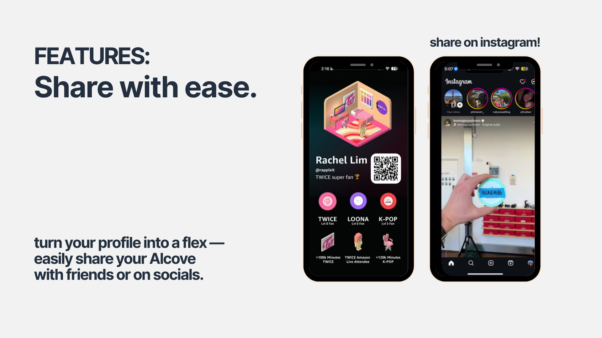
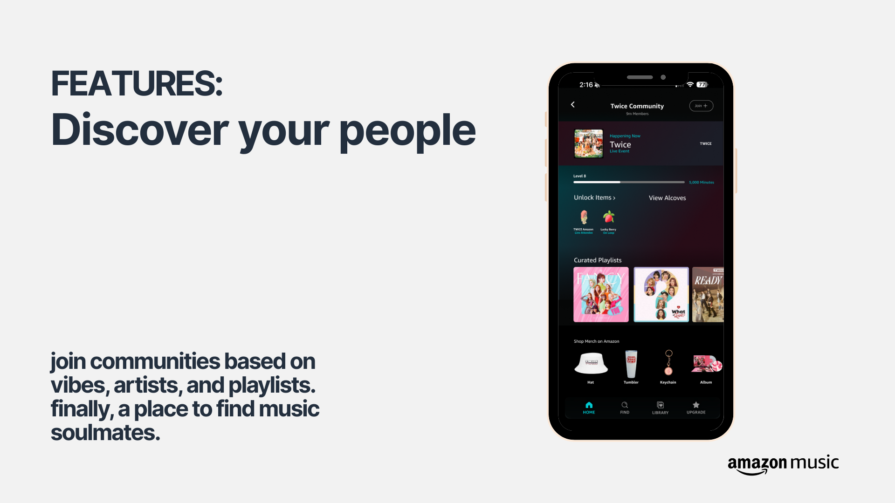
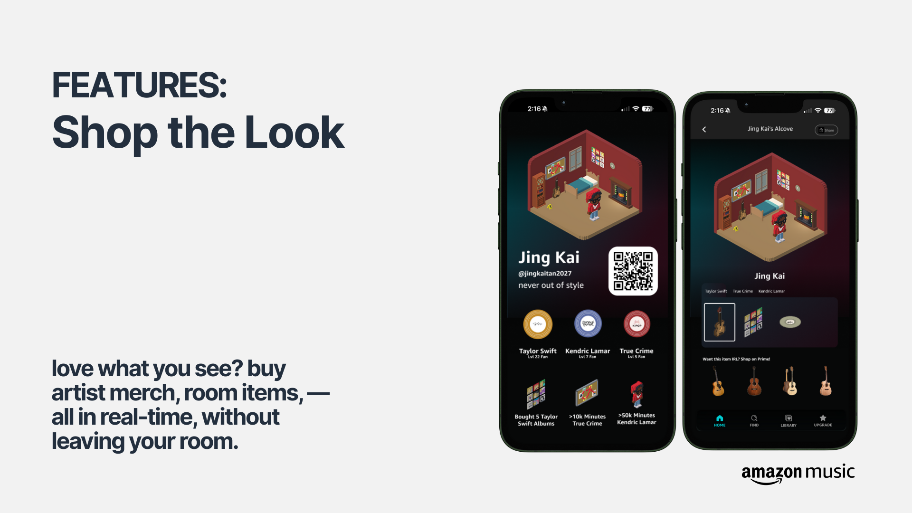

# 🎵 Amazon Alcove

On 13th April 2025, my team and I pitched Amazon Alcove as a solution to the problem statement below:

> How might Amazon Music develop global experiences that create new ways for creators and listeners across all content types to engage with the product?

  

## 🔍 Discover — Understanding the Problem
  
  

* Music streaming is everywhere, but meaningful engagement is lacking.
* Gen Z & Gen Alpha crave authentic self-expression and community.
* Current platforms offer passive listening and generic sharing.
* Music is deeply personal, yet users can't showcase their identity creatively.
* Lack of personalized profiles, social layers, and emotional resonance.

## 📌 Define — Framing the Opportunity

Despite widespread use, streaming apps fall short on creativity, connection, and community.

**Problem Statement:**  
Current music platforms fail to let users creatively express themselves or connect meaningfully with others.

**How Might We:**  

How might we transform music streaming into a canvas for self-expression, where users can creatively showcase their identity and taste?

## 🎨 Develop — Ideation & Solution Design

Enter **Amazon Alcove** — a shareable, customizable space for your music identity.

  

### ✨ Core Features

  

    <h4>🎛️ Customizable Rooms</h4>
    
Style your Alcove with music players, lighting, and decor that reflect your unique taste

    
  

  

    <h4>🏅 Earnable Collectibles</h4>
    
Unlock digital badges for attending events, supporting artists, and reaching music milestones

    
  

  

    <h4>🔗 Easy Sharing</h4>
    
Showcase your profile on social platforms as a digital expression of your music identity

    
  

  

    <h4>🫂 Community Building</h4>
    
Discover fans with similar tastes, join music subcultures, and connect with your vibe tribe

    
  

  

    <h4>🛒 Seamless Shopping</h4>
    
Purchase artist merchandise and exclusive items directly from your personalized space

    
  

## 🚀 Deliver — Bringing It to Life

Launching Amazon Alcove isn't just an update—it's a revolution in how we experience music.

### 💫 Why Alcove Wins:

* 🎯 **Gen Z & Alpha's Dream:** Where expression trumps consumption and personality outshines playlists
* 🧠 **Beyond Just Listening:** Not another streaming app—a digital extension of your musical soul
* 🛍️ **The Amazon Advantage:** Seamlessly blending beats, brands, and belonging in one vibrant ecosystem

### 🌟 The Vision:
Transform passive listeners into passionate curators of their own musical universe—where every song tells your story.

### Positioning:

* 🎯 **For Gen Z & Alpha:** Expression > consumption
* 🧠 **Emotional + Social Utility:** More than streaming — it's a lifestyle
* 🛍️ **Amazon Ecosystem:** Integrates music, commerce, and community
