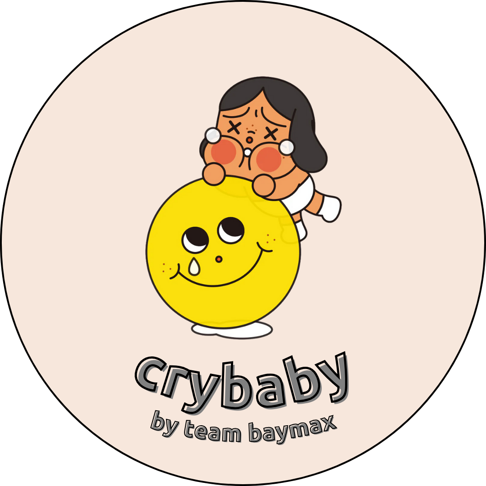
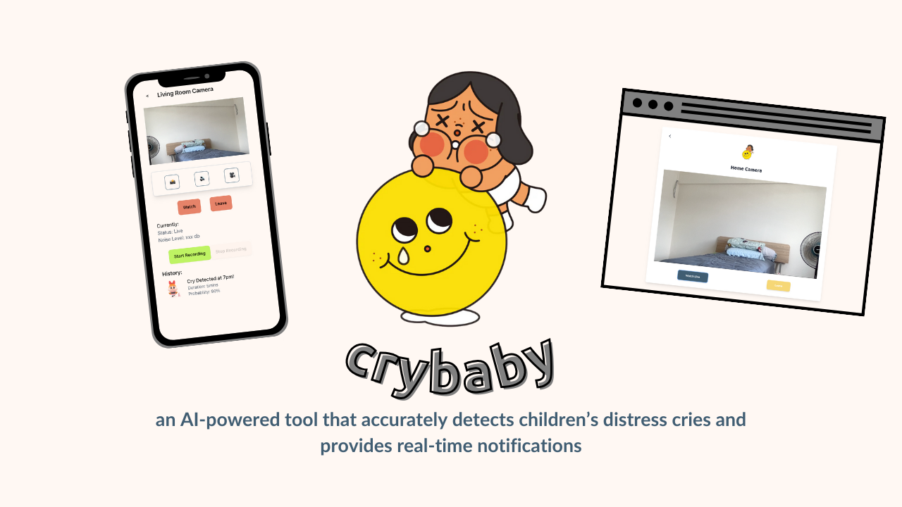
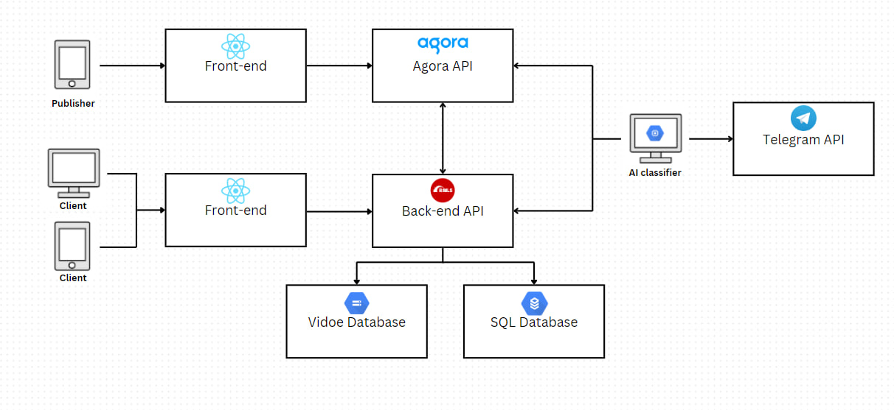

<!-- Improved compatibility of back to top link: See: https://github.com/othneildrew/Best-README-Template/pull/73 -->
<a id="readme-top"></a>


<!-- PROJECT LOGO -->
<br />
<div align="center">
  <a href="https://github.com/github_username/repo_name">
    
  </a>

<h3 align="center">crybaby</h3>

  <p align="center">
    project_description
    <br />
    <br />
    <br />
    <a href="https://youtu.be/L2SNQhx0_Yo">Introduction To Team</a>
    ·
    <a href="https://youtu.be/L2SNQhx0_Yo">Product Video</a>
  </p>
</div>

<!-- TABLE OF CONTENTS -->
<details>
  <summary>Table of Contents</summary>
  <ol>
    <li>
      <a href="#about-the-project">About The Project</a>
      <ul>
        <li><a href="#built-with">Built With</a></li>
      </ul>
    </li>
    <li>
      <a href="#getting-started">Getting Started</a>
      <ul>
        <li><a href="#prerequisites">Prerequisites</a></li>
      </ul>
    </li>
    <li><a href="#usage">Usage</a></li>
    <li><a href="#roadmap">Roadmap</a></li>
    <li><a href="#contributing">Contributing</a></li>
    <li><a href="#license">License</a></li>
    <li><a href="#acknowledgments">Acknowledgments</a></li>
  </ol>
</details>


<!-- ABOUT THE PROJECT -->
## About The Project

<p align="center">
<a href="./img/cover_pic.png">
  
</a>
</p>

This project is a web application built with Ruby on Rails. It includes a PostgreSQL database and Docker for containerization. The application is designed to manage tasks, providing features such as user authentication, task creation, and progress tracking.
<p align="right">(<a href="#readme-top">back to top</a>)</p>


### Built With

Frontend:

[![React][React.js]][React-url]

Backend:

[![Rails][Rails]][Rails-url]
[![Python][Python]][Python-url]
[![Google Cloud][GoogleCloud]][GoogleCloud-url]

<p align="right">(<a href="#readme-top">back to top</a>)</p>


<!-- GETTING STARTED -->
## Getting Started

This is an example of how you may give instructions on setting up your project locally.
To get a local copy up and running follow these simple example steps.

### Prerequisites

- **Ruby version**: 3.2.4
- **Rails version**: 7.1.3
- **Docker version**: 20.10.7
- **PostgreSQL version**: 13

<p align="right">(<a href="#readme-top">back to top</a>)</p>

## Key Dependencies
The project uses several key dependencies, including:

- Rails 7.1.3
- PostgreSQL
- Docker
- RSpec for testing
- Webpacker for managing JavaScript
- Turbo and Stimulus for modern Rails development
- Python: ^3.10, <3.12
- Poetry Dependencies Manager for Python

<p align="right">(<a href="#readme-top">back to top</a>)</p>

For a complete list of dependencies, please refer to the `Gemfile` in the project repository.

<!-- USAGE EXAMPLES -->
## Usage

### User Usage
1. **Register**: Users can register to create an account.
2. **Get the settings from Agora API**: Configure the streaming settings using the Agora API.
3. **Stream**: Start a live stream.
4. **Watch**: View live streams.
5. **Record Stream**: Record streams and save them to history.
6. **Join Telegram Channel**: Get notified when a baby crying is detected.
7. **View History**: Access manually recorded videos or automatically recorded videos when a baby cries, arranged by dates.

**Clone the repository:**
    ```bash
    git clone https://github.com/Service-Design-Studio/1d-final-project-summer-2024-sds-2024-team-09.git
    ```

#### Main Backend
1. **Change directory to the repository:**
    ```bash
    cd 1d-final-project-summer-2024-sds-2024-team-09
    ```
2. **Install dependencies for rails**:
    ```bash
    bundle install
    ```
3. **Set up the database:**
    ```bash
    rails db:create
    rails db:migrate
    rails db:seed
    ```
4. **Run the Rails server**:
    ```bash
    rails server
    ```
5. **Build and run the Docker container: (deploy the program onto a cloud platform)**
    ```bash
    docker-compose up --build
    ```
<p align="right">(<a href="#readme-top">back to top</a>)</p>


#### Front-end
1. **Change directory to the repository:**
    ```bash
    cd 1d-final-project-summer-2024-sds-2024-team-09/frontend
    ```
2. **Install dependencies for React**:
    ```bash
    npm install
    ```
3. **Run executes the dev script for React**:
    ```bash
    npm run dev
    ```
    or deploy the program onto a cloud platform.

#### AI feature
1. **Installation**:
    ```bash
    cd 1d-final-project-summer-2024-sds-2024-team-09/ai_feature
    poetry install
    ```
2. **Set up `baby_cry_AI`**:
    - make a copy of example.env and fill up the necessary fields, including huggingface token and agora token
    - additionally fill in agora token in ai_feature/recording_interval_updated/recording_interval_updated/templates/index.html
    - setup Google Cloud SQL proxy https://cloud.google.com/sql/docs/mysql/sql-proxy
4. **Run the recorder for AI detection**:
      **Change directory to the repository**:

        ```
        cd ai_feature
        ```
     **Connect to GCLoud SQL**:

        ```
        ./cloud_sql_proxy [your project id]:[your project region]:[your gcloud sql]-sql -p 5432
        ```
     **Run detection for AI**:

        ```
        make run
        ```
     **Run recording function for detection**:

        ```
        cd recording_interval_updated/recording_interval_updated
        python to_record.py
        ```
3. **Ensure Connectivity**:
    - Verify that all components (backend, AI system, front-end) are properly connected and communicating.

#### Testing
This project uses a combination of Cucumber for Behavior-Driven Development (BDD) testing and Jest for unit and integration testing of components.

To run the relevant tests, follow these steps:
1. **Cucumber BDD Testing**:
    - The Cucumber BDD tests are located in the `features` directory. This includes the feature files written in Gherkin, step definitions, and any support files necessary for the BDD tests:
      ```bash
      C:\Users\Asus\T5 - SDS\T5-SDS\1d-final-project-summer-2024-sds-2024-team-09\features
      ```
    - **Running the Cucumber tests**:
      1. **Navigate to the project root**:
          ```bash
          cd C:\Users\Asus\T5 - SDS\T5-SDS\1d-final-project-summer-2024-sds-2024-team-09
          ```
      2. **Run the Cucumber tests**:
          ```bash
          bundle exec cucumber
          ```
      - This command will automatically detect and run all the tests in the `features` directory

2. **Jest Testing**:
    - The Jest tests for the frontend components are located in the following directory:
      ```bash
      C:\Users\Asus\T5 - SDS\T5-SDS\1d-final-project-summer-2024-sds-2024-team-09\frontend\src\components\__tests__
      ```
    - **Running the Jest tests**:
      1. **Navigate to the frontend directory**:
          ```bash
          cd C:\Users\Asus\T5 - SDS\T5-SDS\1d-final-project-summer-2024-sds-2024-team-09\frontend
          ```
      2. **Run the Jest tests**:
          ```bash
          npm test
          ```
          or
          ```bash
          npx jest
          ```


<p align="right">(<a href="#readme-top">back to top</a>)</p>


## Architecture
<br />
<div align="center">
  <a href="https://github.com/github_username/repo_name">
    
  </a>

## Full Github Repo: 
https://github.com/Service-Design-Studio/1d-final-project-summer-2024-sds-2024-team-09/blob/main/README.md 