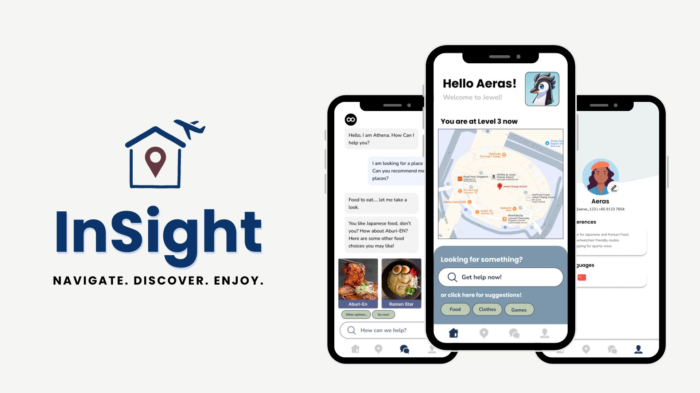
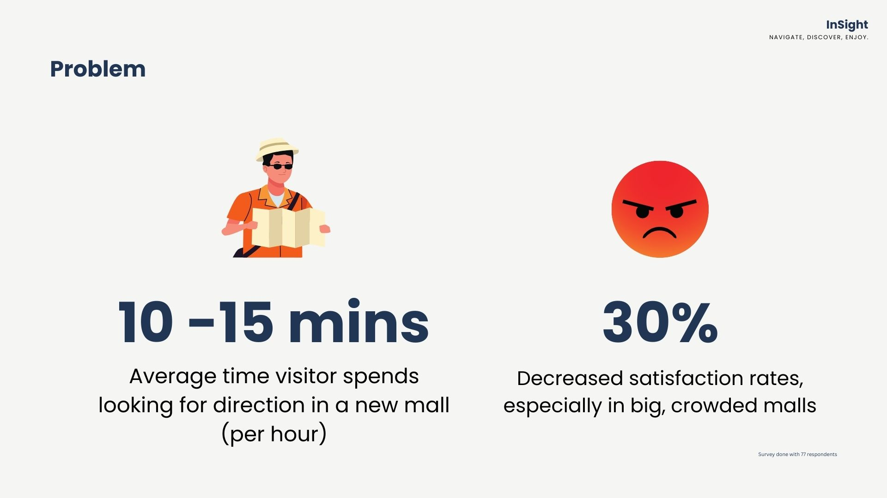
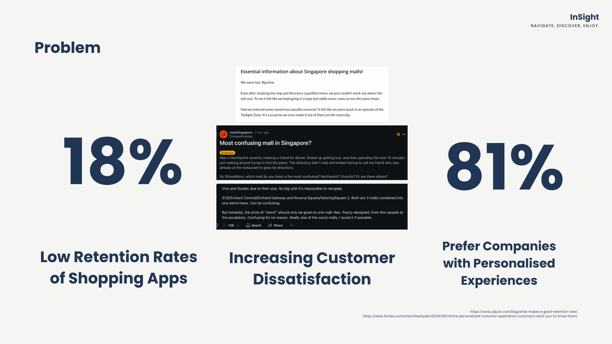
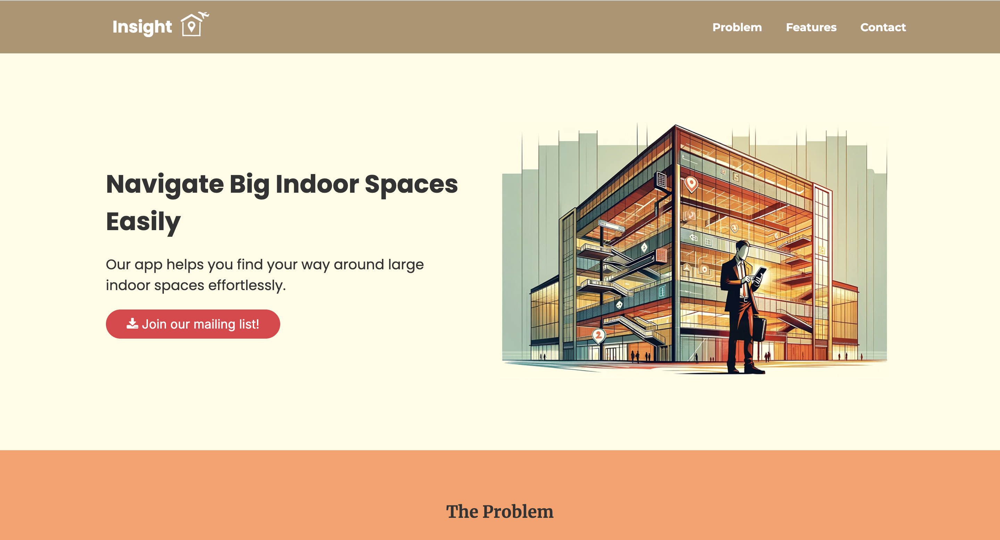
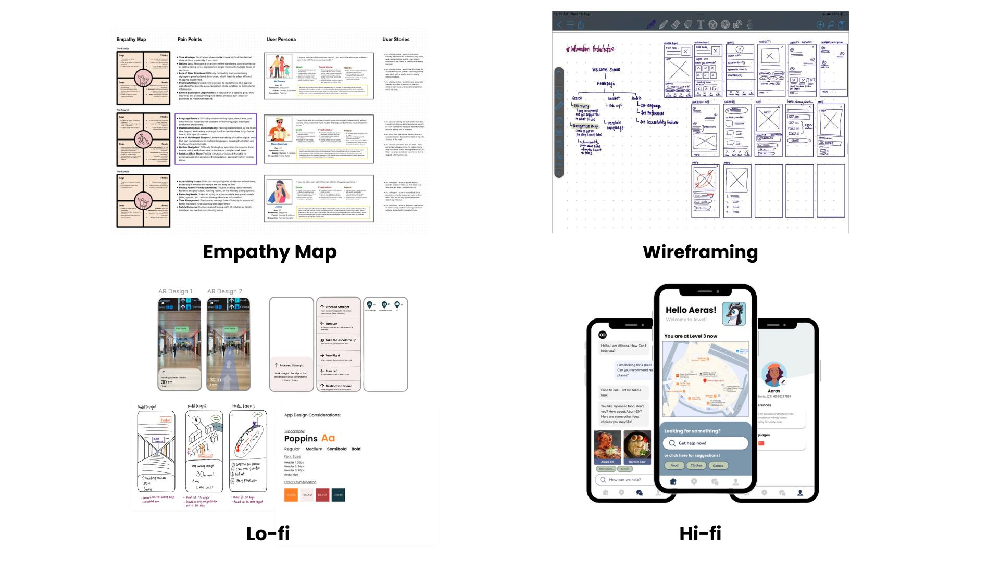
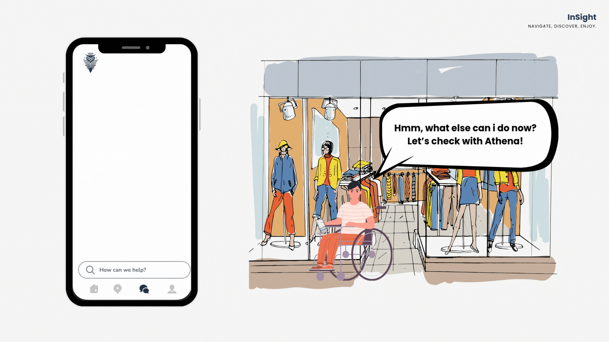
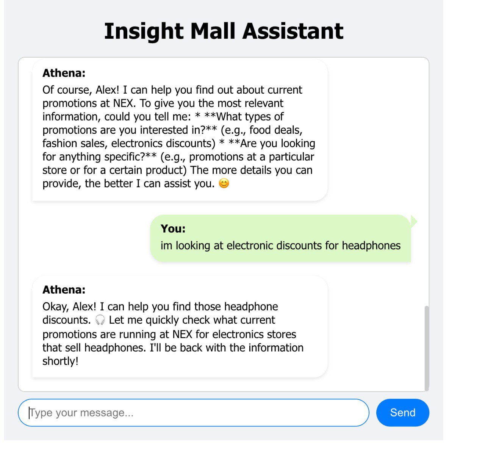
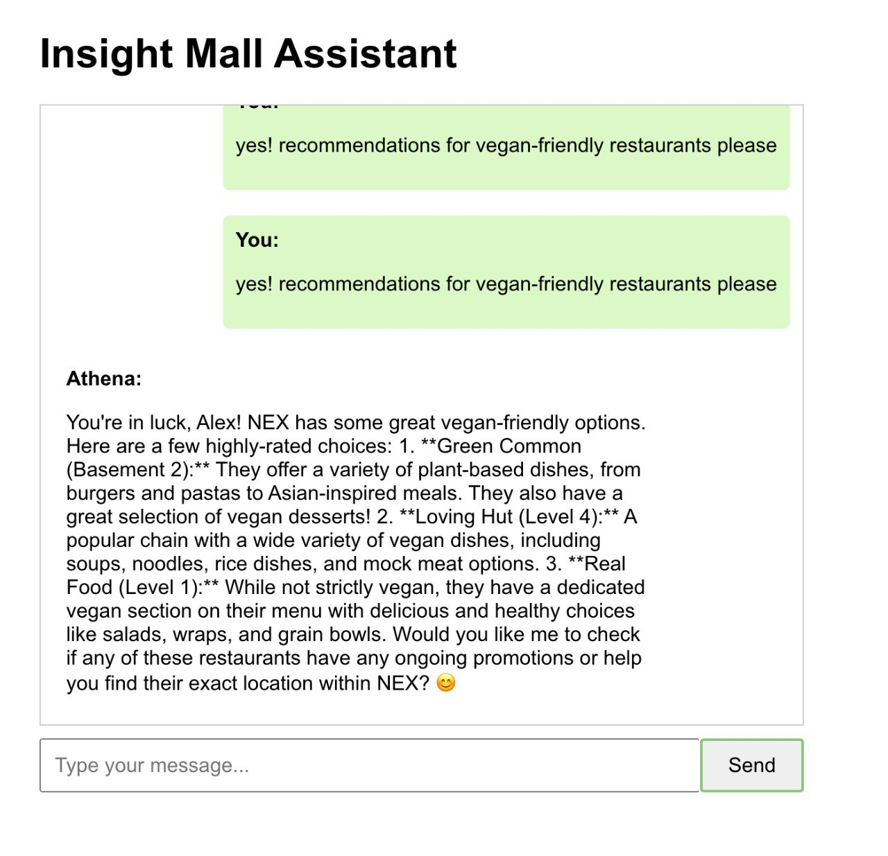

# 🔥 the insight journey

 <!-- Replace with an image/gif of your model in action -->

## 📋 Project Overview

Insight is an indoor navigation project developed during the 30.111 Entrepreneurship course in January 2024. Working together as a team, we aimed to revolutionize how people navigate complex indoor spaces by creating a system that reduces navigation time by 50%. 

The project evolved through two phases, initially with 6 team members and later refined with a core team of 3.

## 🌟 Achievements and Impact

- Successfully reduced indoor navigation time by approximately 50% in test environments
- Conducted over 100 user interviews to validate the problem and solution
- Developed multiple working prototype through 2 iterations of development

## 🎯 Problem Statement

Indoor navigation remains a persistent challenge in large, complex buildings such as:
- Shopping malls
- Hospitals
- University campuses
- Office complexes

 <!-- Replace with an image/gif of your model in action -->

This leads to traditional apps failing to meet the needs of consumers today, leading to negative experiences such as

 <!-- Replace with an image/gif of your model in action -->

## 💡 Our Solution

We developed a smart indoor navigation system that:
- Uses AI to process real-time location data
- Provides turn-by-turn directions
- Adapts to building layout changes
- Offers intuitive user interface

## 🚀 Phase 1

**To be elaborated soon**

## 🛠️ Phase 2

In Phase 2, this project became an undertaking of the MIT$15k 2024 competition. My first responsibility involved creating a landing page to conduct user validation and interest in the project. 

 <!-- Replace with an image/gif of your model in action -->

The link to the landing page is listed here: https://jingkai27.github.io/insight/ 

Subsequently, I was heavily involved in the UIUX design process. I went through the entire UIUX design process to create the UI of the application. Below are snippets from the design process.

 <!-- Replace with an image/gif of your model in action -->

This is one of the gifs showing one of the pages from the final UIUX progress. 

 <!-- Replace with an image/gif of your model in action -->

Subsequently, I also created a prototype for the chatbot was created to showcase the potential of our app. Given a sample list of store directories, it was able to provide correct food recommendations based off clients' profiles with an 85% accuracy. The chatbot was built off Google AI Studio. 

    
    

## 📬 Contact
Feel free to reach out for questions or collaborations:

Name: Tan Jing Kai

Email: jingkai.t27@gmail.com
