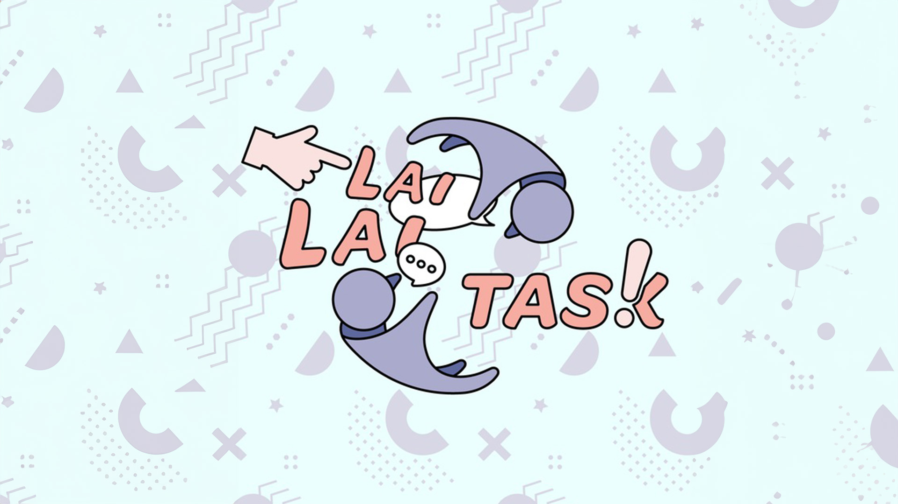
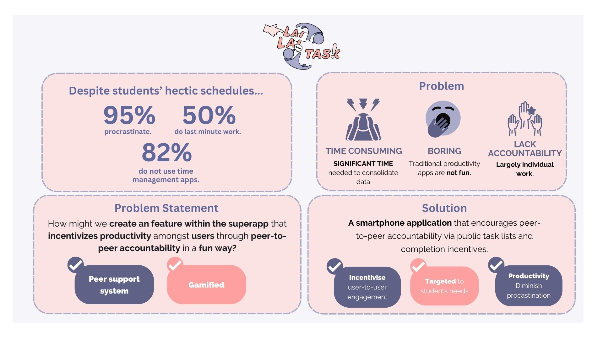
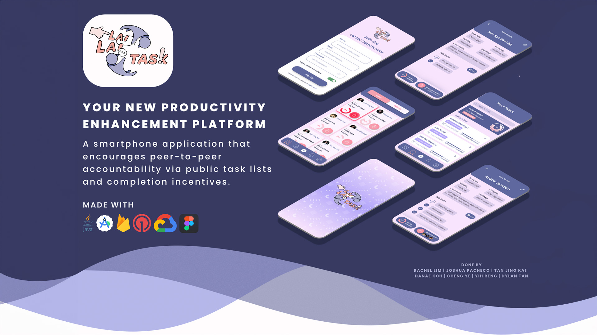
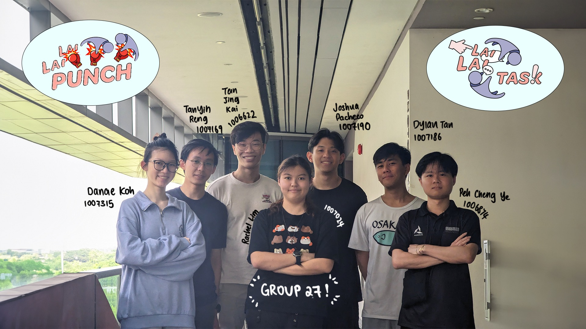
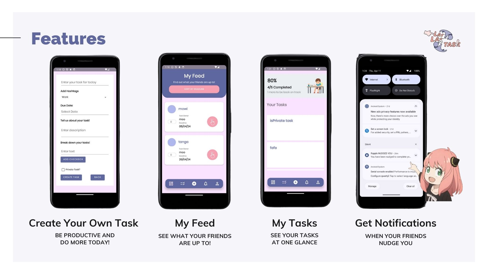
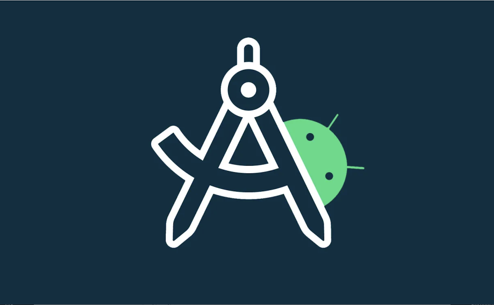

<!-- Improved compatibility of back to top link: See: https://github.com/othneildrew/Best-README-Template/pull/73 -->
<a name="readme-top"></a>
<!--
*** Thanks for checking out the Best-README-Template. If you have a suggestion
*** that would make this better, please fork the repo and create a pull request
*** or simply open an issue with the tag "enhancement".
*** Don't forget to give the project a star!
*** Thanks again! Now go create something AMAZING! :D
-->


<!-- PROJECT SHIELDS -->
<!--
*** I'm using markdown "reference style" links for readability.
*** Reference links are enclosed in brackets [ ] instead of parentheses ( ).
*** See the bottom of this document for the declaration of the reference variables
*** for contributors-url, forks-url, etc. This is an optional, concise syntax you may use.
*** https://www.markdownguide.org/basic-syntax/#reference-style-links
-->

<!-- PROJECT LOGO -->
<br />
<div align="center">
  <a href="https://github.com/50002-computation-structures/1d-project-group-27">
    
  </a>

<h3 align="center">LaiLaiTask G27</h3>
<p>Get productive, together!</p>

  <p align="center">
    <a href="https://github.com/rappleit/LaiLaiTask"><strong>Explore our GitHub page »</strong></a>
    <br />
  </p>
</div>


<!-- TABLE OF CONTENTS -->
<details>
  <summary>Table of Contents</summary>
  <ol>
    <li> <a href="#lailaitask">Project Details</a> </li>
    <li> <a href="#team">Team</a> </li>
    <li> <a href='#features'>Features</a></li>
    <li> <a href='#algorithms'>Algorithms</a></li>
    <li> <a href='#demo'>Demo</a></li>
    <li> <a href='#software-design-principles'>Software Design Principles</a></li>
    <li> <a href='#oop-concepts'>OOP Concepts</a></li>
  </ol>
</details>

<!-- ABOUT THE PROJECT -->
##  LaiLaiTask
**Problem Statement**

Facing tight deadlines? Procastinating on important tasks you need to do? You are not alone. In fact, *95% of students procastinate today* and *50% do last minute work*. 

Therefore, LaiLaiTask aims to be that one feature you need in YouTwitFace, **incentivising productivity amongst users through peer-to-peer accountability in a fun way**.

We envision **university students** like ourselves being our main target audience. However, anyone can benefit from this app to, from working professionals or individuals who simply just want to organise their life better. 



<p align="right">(<a href="#readme-top">back to top</a>)</p>

## App Design


<p align="right">(<a href="#readme-top">back to top</a>)</p>


## Team:

<p align="right">(<a href="#readme-top">back to top</a>)</p>


## Features

- **MVP Features**: 
  - *CYOT: Create Your Own Task*: Add anything you need to do, we will keep you in check 
  - *My Tasks*: All your tasks, in one place.
  - *My Feed*: You snooze, you lose! See what your friends are up to and don't lose out!
  - *Edit Task*: Made a mistake? Edit the task in real time!
  - *Nudge*: Poke your friends and remind them to be productive!
  - *Complete a Task*: Good job! You get points for being productive and flex to your friends on your productivity!

  

  <p align="right">(<a href="#readme-top">back to top</a>)</p>


## Algorithms
- **Priority Queues**: 
  - Our app allows for organisation of tasks by due dates, time and importance. The taskss are stored in a priority queue and can be organised and processed in priority order accordingly. 

  <p align="right">(<a href="#readme-top">back to top</a>)</p>

## Demo

1. Clone LaiLaiTask repository
   ```sh
   gh repo clone rappleit/LaiLaiTask
   ```
2. Ensure that you have Android Studio installed. 


<p align="right">(<a href="#readme-top">back to top</a>)</p>

## Software Design Principles

- **Favor Composition Over Inheritance**: By implementing distinct classes (TaskList, friendList, firebaseUser, TaskFetcher, and TaskSortingStrategy) to handle specific aspects of functionality, we ensure that each class is responsible for a single aspect of the application, *promoting clarity and maintainability*. 
- **Implementing a Loosely Coupled Design**: The TaskSortingStrategy is designed with flexibility in mind, allowing sorting strategies to be added in the future without altering existing code. Currently, users can sort by deadline or nudge. 
- **Builder Design**: A TaskBuilder class is used for the step-by-step creation of Task objects, enhancing readability and maintainability, especially when dealing with objects that require complex construction.
- **Single Responsibility Principle (SRP)**: Classes like User, Task, Fetchers, and FriendList are each defined to handle their specific responsibilities, enabling easier testing and development.
- **Program to an Interface, Not an Implementation**: Interfaces like TaskManager, User/Task Data Fetcher, and Notification abstract the underlying implementations, allowing for the flexibility of using different implementations and easing testing with mocks or stubs.
- **Singleton Pattern**: User class is implemented as a singleton, ensuring that there is only one instance of this class throughout the application, providing a global point of access to the user data.

<p align="right">(<a href="#readme-top">back to top</a>)</p>

## OOP Concepts
- **Encapsuation**: Classes such as TaskList, friendList, TaskFetcher keeps the state and behavior of these objects within these classes.
- **Abstraction**: Interfaces like TaskSortingStrategy, TaskManager, User/Task Data Fetcher, and Notification abstracts data away, allowing other parts of app to interact with these interfaces without needing to understand the underlying complexity.
- **Polymorphism**: The TaskSortingStrategy interface allows for different sorting behaviors (by deadline or by nudge) to be implemented, and the client code can utilize these behaviors interchangeably.

<p align="right">(<a href="#readme-top">back to top</a>)</p>


<!-- 
### Prerequisites

This is an example of how to list things you need to use the software and how to install them.
* npm
  ```sh
  npm install npm@latest -g
  ```

### Installation

1. Get a free API Key at [https://example.com](https://example.com)
2. Clone the repo
   ```sh
   git clone https://github.com/github_username/repo_name.git
   ```
3. Install NPM packages
   ```sh
   npm install
   ```
4. Enter your API in `config.js`
   ```js
   const API_KEY = 'ENTER YOUR API';
   ```

<p align="right">(<a href="#readme-top">back to top</a>)</p>

-->


<!-- MARKDOWN LINKS & img -->
<!-- https://www.markdownguide.org/basic-syntax/#reference-style-links -->
[contributors-shield]: https://img.shields.io/github/contributors/github_username/repo_name.svg?style=for-the-badge
[contributors-url]: https://github.com/github_username/repo_name/graphs/contributors
[forks-shield]: https://img.shields.io/github/forks/github_username/repo_name.svg?style=for-the-badge
[forks-url]: https://github.com/github_username/repo_name/network/members
[stars-shield]: https://img.shields.io/github/stars/github_username/repo_name.svg?style=for-the-badge
[stars-url]: https://github.com/github_username/repo_name/stargazers
[issues-shield]: https://img.shields.io/github/issues/github_username/repo_name.svg?style=for-the-badge
[issues-url]: https://github.com/github_username/repo_name/issues
[license-shield]: https://img.shields.io/github/license/github_username/repo_name.svg?style=for-the-badge
[license-url]: https://github.com/github_username/repo_name/blob/master/LICENSE.txt
[linkedin-shield]: https://img.shields.io/badge/-LinkedIn-black.svg?style=for-the-badge&logo=linkedin&colorB=555
[linkedin-url]: https://linkedin.com/in/linkedin_username
[product-screenshot]: img/screenshot.png
[Next.js]: https://img.shields.io/badge/next.js-000000?style=for-the-badge&logo=nextdotjs&logoColor=white
[Next-url]: https://nextjs.org/
[React.js]: https://img.shields.io/badge/React-20232A?style=for-the-badge&logo=react&logoColor=61DAFB
[React-url]: https://reactjs.org/
[Vue.js]: https://img.shields.io/badge/Vue.js-35495E?style=for-the-badge&logo=vuedotjs&logoColor=4FC08D
[Vue-url]: https://vuejs.org/
[Angular.io]: https://img.shields.io/badge/Angular-DD0031?style=for-the-badge&logo=angular&logoColor=white
[Angular-url]: https://angular.io/
[Svelte.dev]: https://img.shields.io/badge/Svelte-4A4A55?style=for-the-badge&logo=svelte&logoColor=FF3E00
[Svelte-url]: https://svelte.dev/
[Laravel.com]: https://img.shields.io/badge/Laravel-FF2D20?style=for-the-badge&logo=laravel&logoColor=white
[Laravel-url]: https://laravel.com
[Bootstrap.com]: https://img.shields.io/badge/Bootstrap-563D7C?style=for-the-badge&logo=bootstrap&logoColor=white
[Bootstrap-url]: https://getbootstrap.com
[JQuery.com]: https://img.shields.io/badge/jQuery-0769AD?style=for-the-badge&logo=jquery&logoColor=white
[JQuery-url]: https://jquery.com 

<!--
### Built With

* [![Next][Next.js]][Next-url]
* [![React][React.js]][React-url]
* [![Vue][Vue.js]][Vue-url]
* [![Angular][Angular.io]][Angular-url]
* [![Svelte][Svelte.dev]][Svelte-url]
* [![Laravel][Laravel.com]][Laravel-url]
* [![Bootstrap][Bootstrap.com]][Bootstrap-url]
* [![JQuery][JQuery.com]][JQuery-url]

<p align="right">(<a href="#readme-top">back to top</a>)</p> -->
