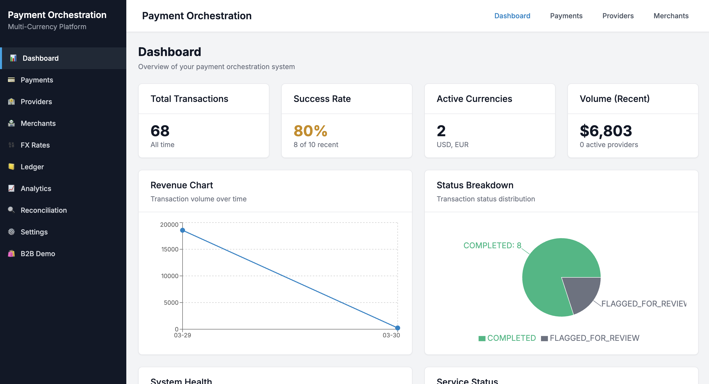
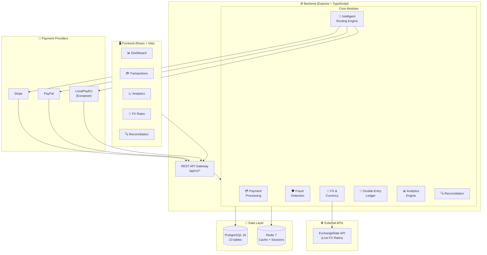
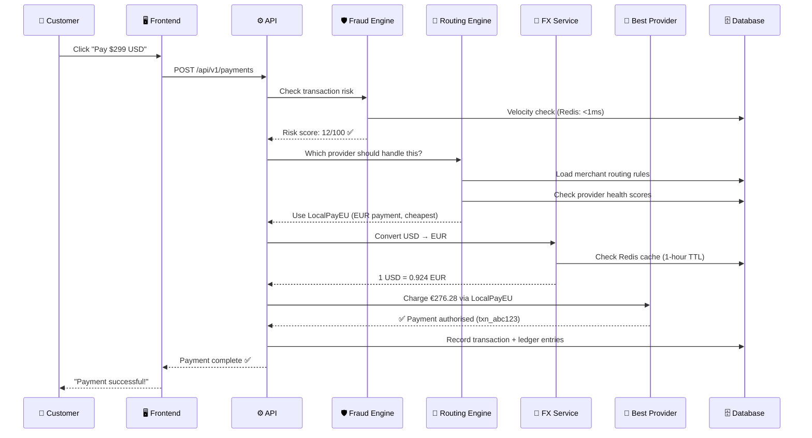

# PayOrch — Multi-Currency Payment Orchestration Platform

> **tldr** i built a mock, full-stack fintech platform that acts as a smart router for payment transactions — think of it like Google Maps, but for money. instead of routing cars through the fastest roads, it routes payments through the cheapest and most reliable payment provider in real time.

<div align="center">


</div>

---

## The Problem (For Everyone)

Imagine you run an online store. Every time someone pays you, the transaction goes through a payment gateway — like Stripe or PayPal. These gateways charge a **processing fee** (typically 2.5%–3.5% per transaction). However... 

- Stripe is great for US cards, but expensive for European transactions
- PayPal is preferred by some buyers but has higher decline rates for international cards
- Local European processors (like iDEAL) are far cheaper for EU payments but most platforms don't support them

Most businesses pick **one** gateway and stick with it — overpaying on fees and losing sales when that provider has downtime.

**MCPOS solves this.** It sits between your store and all the payment providers, intelligently deciding which gateway to use for *each individual transaction* based on currency, geography, fees, and provider health — all in milliseconds.

### Real Impact

```
Traditional Setup:   Stripe for everything → 3.4% fee on every transaction
MCPOS Approach:    Route EU payments to LocalPayEU (1.2%), US to Stripe (2.9%)

On $1,000,000 in annual transactions:
  Old way:  $34,000 in fees
  MCPOS:  ~$18,000 in fees
  Saved:    ~$16,000/year (47% reduction)
```

## Live Dashboard Preview

The frontend dashboard updates every 30 seconds automatically and includes a real-time SSE feed showing transactions as they happen:




---

## System Architecture



---

## How a Payment Actually Works

Here's what happens in under 200ms when someone clicks "Pay Now":



## Feature Breakdown

### Core Features at a Glance

| Module | What It Does | Cool Bit |
|--------|-------------|----------|
| 💳 **Payments** | Create, capture, cancel, refund transactions | Idempotency keys prevent double charges on network retries |
| 🧭 **Routing Engine** | Picks the best payment provider per transaction | Custom merchant rules + dynamic scoring in <5ms |
| 💱 **FX & Currency** | Live exchange rates for 10 currencies | 1-hour Redis cache, fallback provider, spread markup |
| 🛡️ **Fraud Detection** | Catches suspicious transactions before they process | Sub-millisecond velocity checks via Redis |
| 📒 **Ledger** | Double-entry accounting for every dollar | Every debit has a matching credit — accounting 101 but in code |
| 🔍 **Reconciliation** | Compares internal records vs. provider statements | Catches amount mismatches, missing transactions, ghost charges |
| 📊 **Analytics** | Real-time + historical dashboards | SSE live feed, 30-second refresh cycles |
| 🔐 **Auth** | JWT login, API keys, role-based access | bcrypt (12 rounds), HMAC webhook verification |

---

## Engineering Decisions Worth Knowing About

The system runs on 23 PostgreSQL tables. Attached are some of the key desingn dscisions when designing the database. 

**Key design decisions:**
- `transactions` uses a state machine (PENDING → PROCESSING → COMPLETED/FAILED/REFUNDED)
- `transaction_status_history` is immutable — every status change is recorded forever
- `ledger_entries` uses double-entry accounting: every debit is matched by an equal credit
- `fx_rates` have validity windows, so historical rates are always queryable

### Backend

**Patterns used:**
- **Singleton Services**: `PaymentService.getInstance()` — one instance, no duplicate DB connections
- **Adapter Pattern**: `IPaymentProviderAdapter` interface normalises Stripe/PayPal/LocalPayEU APIs
- **Repository Pattern**: Prisma client abstracted per module
- **State Machine**: Transaction statuses enforce valid transitions only

### Frontend

**State management philosophy:** No Redux, no Zustand. [React Query](https://tanstack.com/query) handles all server state — automatic background refetching, optimistic updates, and smart cache invalidation. Local UI state stays in `useState`.

### Modular Monolith over Microservices
Research into Microservices showed added serious operational overhead, such as separate deployments, network hops between services, distributed tracing and more. For a start, I decided to go with the **modular monolith** to reap 80% of its benefits (clear boundaries, isolated business logic) with 20% of the complexity. The modular monolith model to easily decouple in the future too. 

### Double-Entry Accounting
Single-entry accounting (just logging transactions) makes it easy to accidentally create money or lose track of funds. Double-entry forces **every debit to have a matching credit**, which is used by banks and other fintech firms.

### Redis for Fraud Detection
Fraud velocity checks need to answer "has this IP made 3+ payments in the last 60 seconds?" across *all* server instances simultaneously. Redis handles this in <1ms with atomic increment operations. A PostgreSQL query would be 50–200ms and wouldn't scale horizontally without race conditions.

### Idempotency Keys
Without idempotency keys, a customer might get charged twice for one order. With them, retrying the same request always returns the same result — the second attempt detects the duplicate key and returns the original response.

## About

Built by [Jing Kai](https://github.com/jingkai27) — a software engineer interested in fintech infrastructure, distributed systems, and building things that actually work at scale.

*If you're a recruiter reading this: I'm happy to walk through any part of the architecture in detail, discuss design tradeoffs, or pair-code a feature extension. Reach out at jingkai.t27@gmail.com.*

