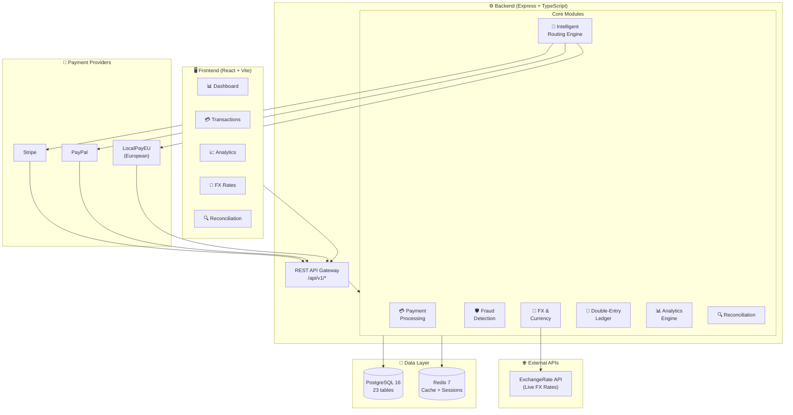
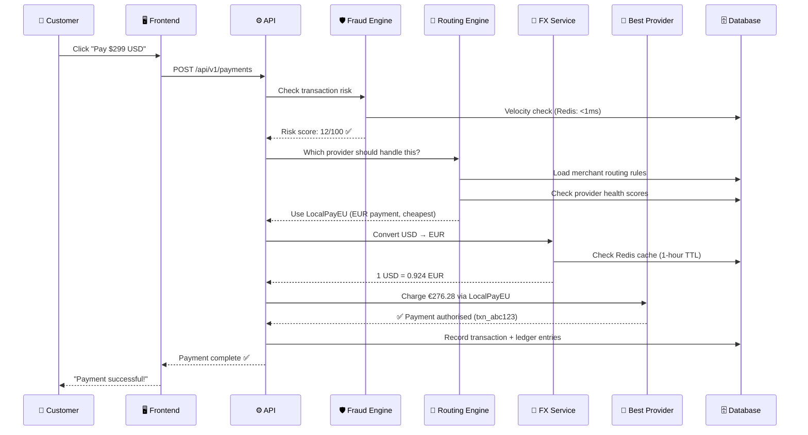
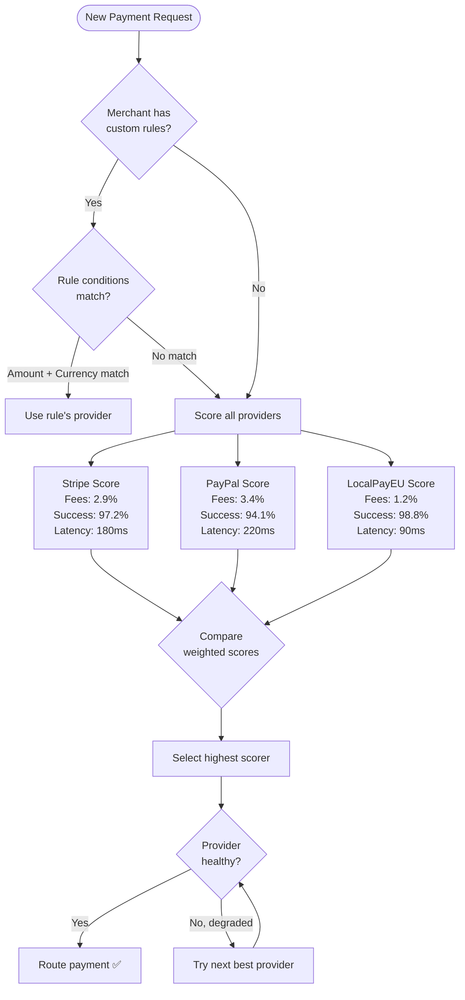
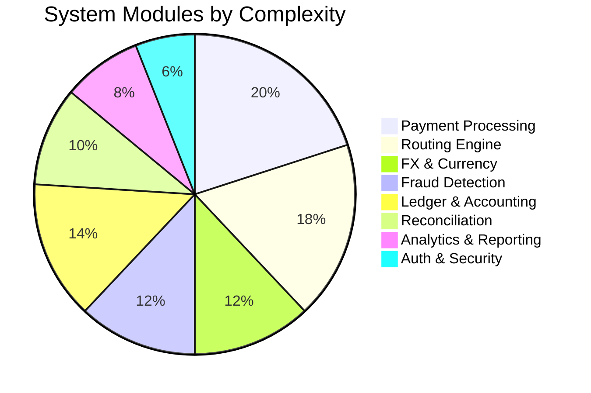
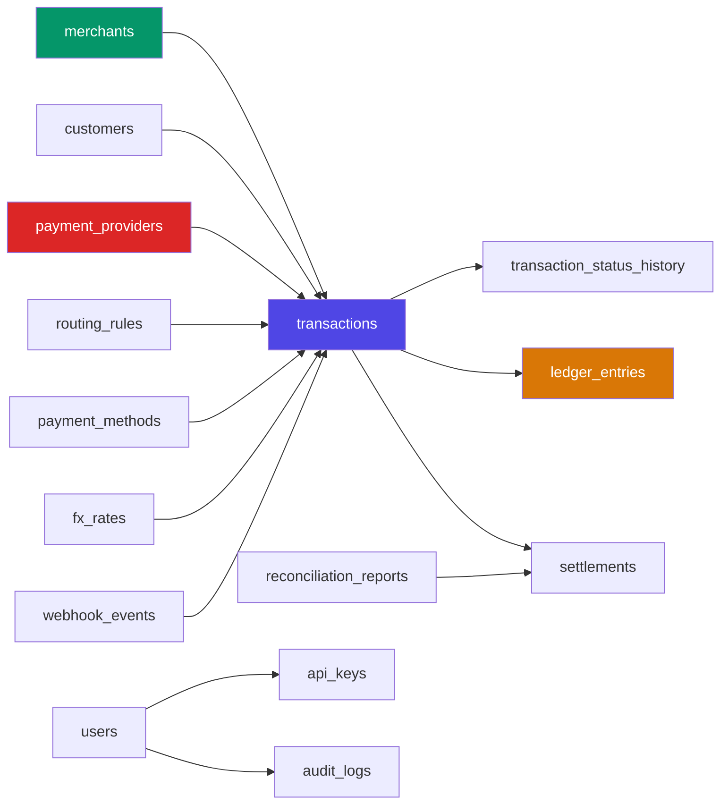
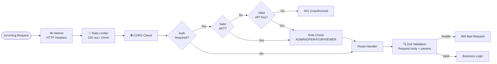

# PayOrch — Multi-Currency Payment Orchestration Platform

> **TL;DR:** I built a full-stack fintech platform that acts as a smart router for payment transactions — think of it like Google Maps, but for money. Instead of routing cars through the fastest roads, it routes payments through the cheapest and most reliable payment provider in real time.

<div align="center">


</div>

---

## The Problem (For Everyone)

Imagine you run an online store. Every time someone pays you, the transaction goes through a payment gateway — like Stripe or PayPal. These gateways charge a **processing fee** (typically 2.5%–3.5% per transaction). Here's the catch:

- Stripe is great for US cards, but expensive for European transactions
- PayPal is preferred by some buyers but has higher decline rates for international cards
- Local European processors (like iDEAL) are far cheaper for EU payments but most platforms don't support them

Most businesses pick **one** gateway and stick with it — overpaying on fees and losing sales when that provider has downtime.

**PayOrch solves this.** It sits between your store and all the payment providers, intelligently deciding which gateway to use for *each individual transaction* based on currency, geography, fees, and provider health — all in milliseconds.

### Real Impact

```
Traditional Setup:   Stripe for everything → 3.4% fee on every transaction
PayOrch Approach:    Route EU payments to LocalPayEU (1.2%), US to Stripe (2.9%)

On $1,000,000 in annual transactions:
  Old way:  $34,000 in fees
  PayOrch:  ~$18,000 in fees
  Saved:    ~$16,000/year (47% reduction)
```

---

## System Architecture



---

## How a Payment Actually Works

Here's what happens in under 200ms when someone clicks "Pay Now":



---

## Intelligent Routing — The Secret Sauce

The routing engine is the core innovation. It's not just a round-robin or random picker — it evaluates every provider against a scoring function:



### Provider Comparison (Sample Data)

```mermaid
xychart-beta
    title "Processing Fee by Provider & Currency (%)"
    x-axis ["USD", "EUR", "GBP", "SGD", "JPY"]
    y-axis "Fee %" 0 --> 4
    bar [2.9, 3.2, 3.1, 3.4, 3.5]
    bar [3.4, 3.4, 3.4, 3.4, 3.4]
    bar [3.8, 1.2, 1.4, 3.8, 3.8]
```


*Stripe (blue) · PayPal (orange) · LocalPayEU (green) — lower is better*

---

## Feature Breakdown



### Core Features at a Glance

| Module | What It Does | Cool Bit |
|--------|-------------|----------|
| 💳 **Payments** | Create, capture, cancel, refund transactions | Idempotency keys prevent double charges on network retries |
| 🧭 **Routing Engine** | Picks the best payment provider per transaction | Custom merchant rules + dynamic scoring in <5ms |
| 💱 **FX & Currency** | Live exchange rates for 10 currencies | 1-hour Redis cache, fallback provider, spread markup |
| 🛡️ **Fraud Detection** | Catches suspicious transactions before they process | Sub-millisecond velocity checks via Redis |
| 📒 **Ledger** | Double-entry accounting for every dollar | Every debit has a matching credit — accounting 101 but in code |
| 🔍 **Reconciliation** | Compares internal records vs. provider statements | Catches amount mismatches, missing transactions, ghost charges |
| 📊 **Analytics** | Real-time + historical dashboards | SSE live feed, 30-second refresh cycles |
| 🔐 **Auth** | JWT login, API keys, role-based access | bcrypt (12 rounds), HMAC webhook verification |

---

## Database Design

The system runs on 23 PostgreSQL tables. Here's the core data model:



**Key design decisions:**
- `transactions` uses a state machine (PENDING → PROCESSING → COMPLETED/FAILED/REFUNDED)
- `transaction_status_history` is immutable — every status change is recorded forever
- `ledger_entries` uses double-entry accounting: every debit is matched by an equal credit
- `fx_rates` have validity windows, so historical rates are always queryable

---

## Tech Stack Deep Dive

### Backend

```
packages/backend/
├── src/
│   ├── config/          # Zod-validated env vars (fail fast on startup)
│   ├── middleware/       # Auth, rate limiting, error handling
│   ├── modules/
│   │   ├── analytics/   # Real-time + historical stats
│   │   ├── auth/        # JWT + API key authentication
│   │   ├── demo/        # Live scenario simulation (SSE feed)
│   │   ├── fraud/       # Rule-based fraud detection
│   │   ├── fx/          # Exchange rates + currency conversion
│   │   ├── ledger/      # Double-entry accounting
│   │   ├── merchant/    # B2B merchant + customer management
│   │   ├── payment/     # Core payment processing
│   │   ├── payment-method/ # Tokenised cards & wallets
│   │   ├── provider/    # Payment gateway adapters
│   │   │   └── adapters/
│   │   │       ├── stripe.adapter.ts
│   │   │       ├── paypal.adapter.ts
│   │   │       └── localpayeu.adapter.ts
│   │   ├── reconciliation/ # Settlement reconciliation
│   │   └── routing/     # Intelligent provider selection
│   └── routes/          # Route registration
├── prisma/
│   ├── schema.prisma    # 23-table database schema
│   └── seed.ts          # Development seed data
```

**Patterns used:**
- **Singleton Services**: `PaymentService.getInstance()` — one instance, no duplicate DB connections
- **Adapter Pattern**: `IPaymentProviderAdapter` interface normalises Stripe/PayPal/LocalPayEU APIs
- **Repository Pattern**: Prisma client abstracted per module
- **State Machine**: Transaction statuses enforce valid transitions only

### Frontend

```
packages/frontend/src/
├── api/              # Axios clients per domain (payments, fx, analytics, demo)
├── components/
│   ├── layout/       # Sidebar, Header, Layout shell
│   └── features/     # LiveTransactionFeed, ProviderHealthMatrix, FraudLog
├── hooks/            # useSSEFeed (real-time events), custom query hooks
├── pages/            # 9 full pages
└── types/            # Shared TypeScript types
```

**State management philosophy:** No Redux, no Zustand. [React Query](https://tanstack.com/query) handles all server state — automatic background refetching, optimistic updates, and smart cache invalidation. Local UI state stays in `useState`.

---

## Live Dashboard Preview

The frontend dashboard updates every 30 seconds automatically and includes a real-time SSE feed showing transactions as they happen:

```
┌─────────────────────────────────────────────────────────────────┐
│  PayOrch Dashboard                              🟢 Live          │
├──────────────┬──────────────┬──────────────┬────────────────────┤
│  Total Txns  │ Success Rate │ Volume (USD) │  Savings Today     │
│    1,284     │    96.8%     │  $847,293    │     $3,241         │
├──────────────┴──────────────┴──────────────┴────────────────────┤
│  Transaction Volume (Last 24h)                                   │
│  $50K ┤                    ╭──╮                                  │
│  $40K ┤          ╭──╮    ╭╯  ╰╮                                  │
│  $30K ┤    ╭──╮ ╭╯  ╰────╯    ╰──╮                              │
│  $20K ┤────╯  ╰─╯                 ╰──────                        │
│       └──────────────────────────────────                        │
│       00:00  04:00  08:00  12:00  16:00  20:00                   │
├──────────────────────────┬──────────────────────────────────────┤
│  Status Breakdown        │  Live Transaction Feed               │
│  ██████████ Completed 89%│  ✅ $432 USD via Stripe    0.2s ago  │
│  ███ Failed 5%           │  ✅ €918 EUR via LocalPayEU 0.8s ago │
│  ██ Pending 4%           │  🛡️ $5,200 FLAGGED          1.1s ago │
│  █ Refunded 2%           │  ✅ £150 GBP via PayPal     2.3s ago │
├──────────────────────────┴──────────────────────────────────────┤
│  Provider Health                                                  │
│  🟢 Stripe        97.2% success  │  180ms avg latency           │
│  🟢 PayPal        94.1% success  │  220ms avg latency           │
│  🟡 LocalPayEU    98.8% success  │  90ms avg latency            │
└─────────────────────────────────────────────────────────────────┘
```

---

## API Reference (Selected Endpoints)

The REST API follows a versioned `/api/v1/*` structure with 40+ endpoints across 10 domains:

```bash
# Create a payment
POST /api/v1/payments
{
  "amount": 299.99,
  "currency": "EUR",
  "merchantId": "merch_abc",
  "customerId": "cust_xyz",
  "paymentMethodId": "pm_card_123",
  "idempotencyKey": "order_2024_456"
}

# Get live FX rates
GET /api/v1/fx/rates

# Run fraud check
POST /api/v1/fraud/check
{ "transactionId": "txn_abc123" }

# Trigger reconciliation
POST /api/v1/reconciliation/reconcile
{ "providerId": "stripe", "settlementDate": "2024-01-15" }

# Real-time analytics
GET /api/v1/analytics/real-time
# → Updates every 30 seconds, cached in Redis
```

---

## Security Architecture



Security highlights:
- **Passwords**: bcrypt with 12 salt rounds (industry standard: 10–12)
- **Tokens**: JWT, 24-hour expiry
- **Webhooks**: HMAC-SHA256 signature verification (prevents spoofed provider events)
- **Rate Limiting**: 100 requests/15 minutes per IP
- **Headers**: Helmet sets `X-Frame-Options`, `X-XSS-Protection`, HSTS, etc.

---

## Engineering Decisions Worth Knowing About

### Why a Modular Monolith (not Microservices)?
Microservices add serious operational overhead — separate deployments, network hops between services, distributed tracing, service discovery. For a project at this scale, a **modular monolith** gives you 80% of the benefits (clear boundaries, isolated business logic) with 20% of the complexity. Each module (`payment/`, `routing/`, `fraud/`) is decoupled enough to extract later if needed.

### Why Double-Entry Accounting?
Single-entry accounting (just logging transactions) makes it easy to accidentally create money or lose track of funds. Double-entry forces **every debit to have a matching credit** — the math either balances or your code has a bug. Banks and every serious fintech use this for a reason.

### Why Redis for Fraud Detection?
Fraud velocity checks need to answer "has this IP made 3+ payments in the last 60 seconds?" across *all* server instances simultaneously. Redis handles this in <1ms with atomic increment operations. A PostgreSQL query would be 50–200ms and wouldn't scale horizontally without race conditions.

### Why Idempotency Keys?
Networks fail. Browsers time out. Users double-click. Without idempotency keys, a customer might get charged twice for one order. With them, retrying the same request always returns the same result — the second attempt detects the duplicate key and returns the original response.

---

## Running It Locally

```bash
# Prerequisites: Node.js 18+, pnpm, Docker

# 1. Start databases
docker compose up -d

# 2. Install dependencies
pnpm install

# 3. Set up environment
cp packages/backend/.env.example packages/backend/.env
# Add your FX API key + provider credentials

# 4. Seed the database
cd packages/backend
pnpm prisma migrate dev
pnpm prisma db seed

# 5. Start everything
pnpm dev   # Runs both frontend + backend concurrently

# Frontend: http://localhost:5173
# Backend:  http://localhost:3000
# API docs: http://localhost:3000/api/v1/health
```

---

## Testing

```bash
cd packages/backend
pnpm test              # Run all tests
pnpm test --coverage   # With coverage report
```

**8 test suites covering:**
- Auth service (registration, login, JWT)
- Fraud detection (velocity checks, risk scoring)
- Reconciliation (discrepancy detection algorithms)
- Ledger (double-entry balance validation)
- Payment methods (tokenisation, default selection)
- Merchants & customers (CRUD, multi-tenancy)
- Analytics (aggregation, cache invalidation)
- Health routes (endpoint availability)

**Testing philosophy:** Mock the database and Redis (Prisma + ioredis mocks), but test real business logic. No integration tests hitting live services — that's what staging environments are for.

---

## What I Learned Building This

1. **Financial systems need way more state than you think.** A payment isn't just "paid/unpaid" — it's PENDING → PROCESSING → AUTHORISED → CAPTURED → REFUNDED, with every transition logged immutably. Skipping this makes debugging production issues nearly impossible.

2. **Caching is a consistency problem, not a performance problem.** Redis makes things fast, but the hard part is deciding *when* to invalidate. FX rates cached for too long lose accuracy; cached for too short, you're hammering external APIs.

3. **Provider abstraction is worth it from day one.** When I added LocalPayEU, it took 30 minutes because the adapter interface was already defined. Without it, it would've touched 15 files.

4. **Idempotency is not optional in payment systems.** Spent two hours thinking through all the ways duplicate charges could happen. Worth every minute.

5. **Real-time features change how users perceive reliability.** The SSE live feed on the dashboard makes the system *feel* faster and more trustworthy, even though the underlying processing time is identical.

---

## Project Stats

| Metric | Count |
|--------|-------|
| Backend modules | 13 |
| API endpoints | 40+ |
| Database tables | 23 |
| Supported currencies | 10 |
| Payment providers | 3 |
| Frontend pages | 9 |
| Test suites | 8 |
| Lines of TypeScript | ~8,000 |

---

## About

Built by [Jing Kai](https://github.com/jingkai27) — a software engineer interested in fintech infrastructure, distributed systems, and building things that actually work at scale.

*If you're a recruiter reading this: I'm happy to walk through any part of the architecture in detail, discuss design tradeoffs, or pair-code a feature extension. Reach out at jingkai.t27@gmail.com.*

*If you're a friend reading this: basically I built the backend of what Stripe does, but in 3 months and without a 3,000-person team. Yes I'm aware that's a bit much.*
