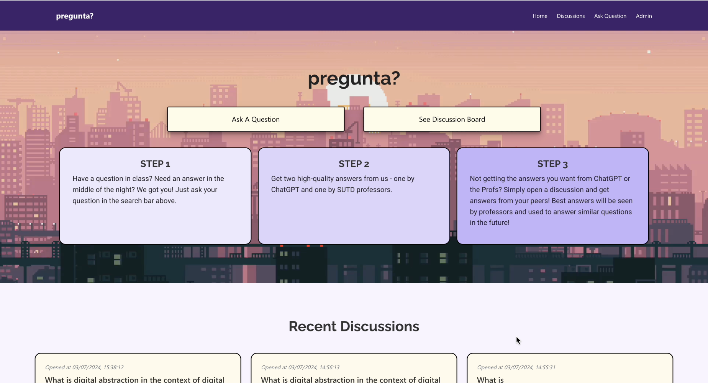

# 🔥 pregunta?

 <!-- Replace with an image/gif of your model in action -->

## 📋 Project Overview

*pregunta?* is a project developed as part of the CampusX builders program in SUTD. The CampusX project is one that is aimed at developing the technology capabilities of the school. 

This project fits in by creating an optimised forum that allows students to ask questions and get precise and accurate results. 

## 🎯 Problem Statement
With the rise of ChatGPT, students are increasingly reliant on large language models to answer their questions in real time. However, **these answers may not be accurate**, which will negatively affect students' understanding of the topics at hand. 

**How might we create an integrated solution that leverages on the capabilities of AI to allow students to get real-time, accurate answers to enhance their learnings?**

## 🌟 Achievements

- Successful creation and deployment of a forum which allows students to open discussion questions, **get professor-validated answers and ChatGPT answers instantly and discuss with students in real time**. 
- Allows professors to pick through the best answers and update their professor-validated answers in real-time
- Successful integration of the app into Microsoft Teams, a common platform used by the school for curriculum discussions. 

## 💡 Our Solution

We developed a smart AI-powered forum/discussion board that:
- Uses AI to provide answers for questions asked
- Allows students to ask questions
- Ability to parse through documents and generate correct answers 
- Offers intuitive user interface for students and professors
- Professors are able to update their model answers in real time. 

## 🚀 Phase 1

**Obtain reply from both OpenAI and Azure Language Studio.**

When students asks a question, the student should be able to get two responses, one from OpenAI and another from the Professors' database. While prompting Open AI was easy, obtaining responses from the Professors' database served to be more challenging. 

Leveraging onto Azure Language Studio's capabilities, we were able to automatically extract question and answer pairs from excel sheets and have the bot serve the correct answers with different wordings of the same question. Subsequently, we developed the database framework which would allow us to update the database in real time while having the questions processed accurately. 

## 🛠️ Phase 2

**Deployment to Microsoft Teams and the UAT server**

Once we completed the initial round of research and development, we then went on to deploy the whole service onto Microsoft Teams, as well as the school's testing servers. 

Our main challenges here lay in having to liaise with the university's IT Department, understanding and obtaining the required permissions for deployment and finally actually deploying it. This turned out to be the hardest part, but in the process, we were able to have a more comprehensive understanding of the entire infrastructure of the servers, how to navigate around them and actually successfully deploy a prototype of an app for testing. 

## 👍🏻 Phase 3

**Touch up UIUX and functionalities**

Finally, we cleaned up and optimised the rest of the UIUX and functionalities for subsequent deployments. 

- Created user-friendly UIUX for professors to modify answers in real-time
- Created user-friendly UIUX for students to ask questions and engage with other students

New functionalities included: 

1. Ability to upvote and downvote a response
2. Ability to add comments to a student's response
3. Ability for professors to comment to a discussion thread

## 📬 Contact
Feel free to reach out for questions or collaborations:

Name: Tan Jing Kai

Email: jingkai.t27@gmail.com
